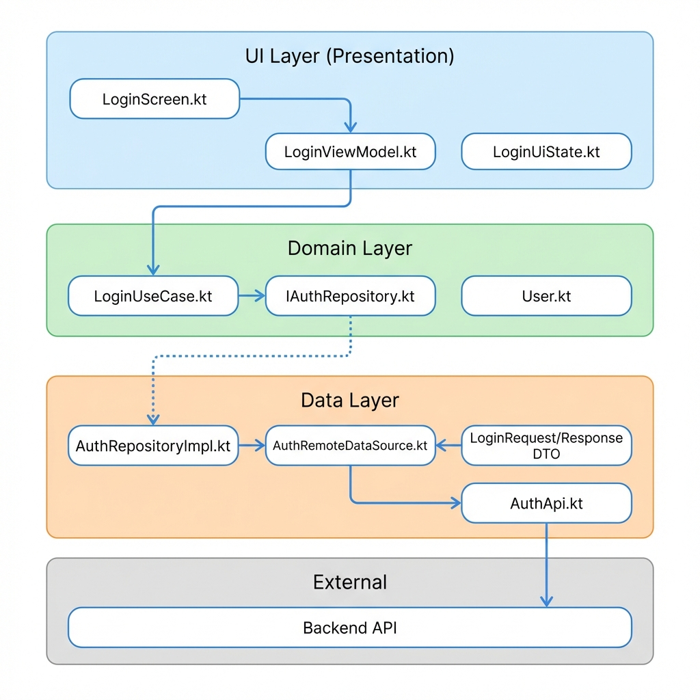
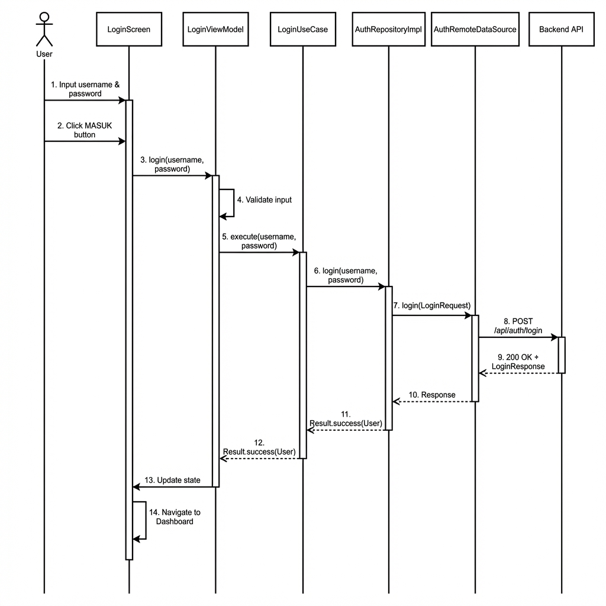
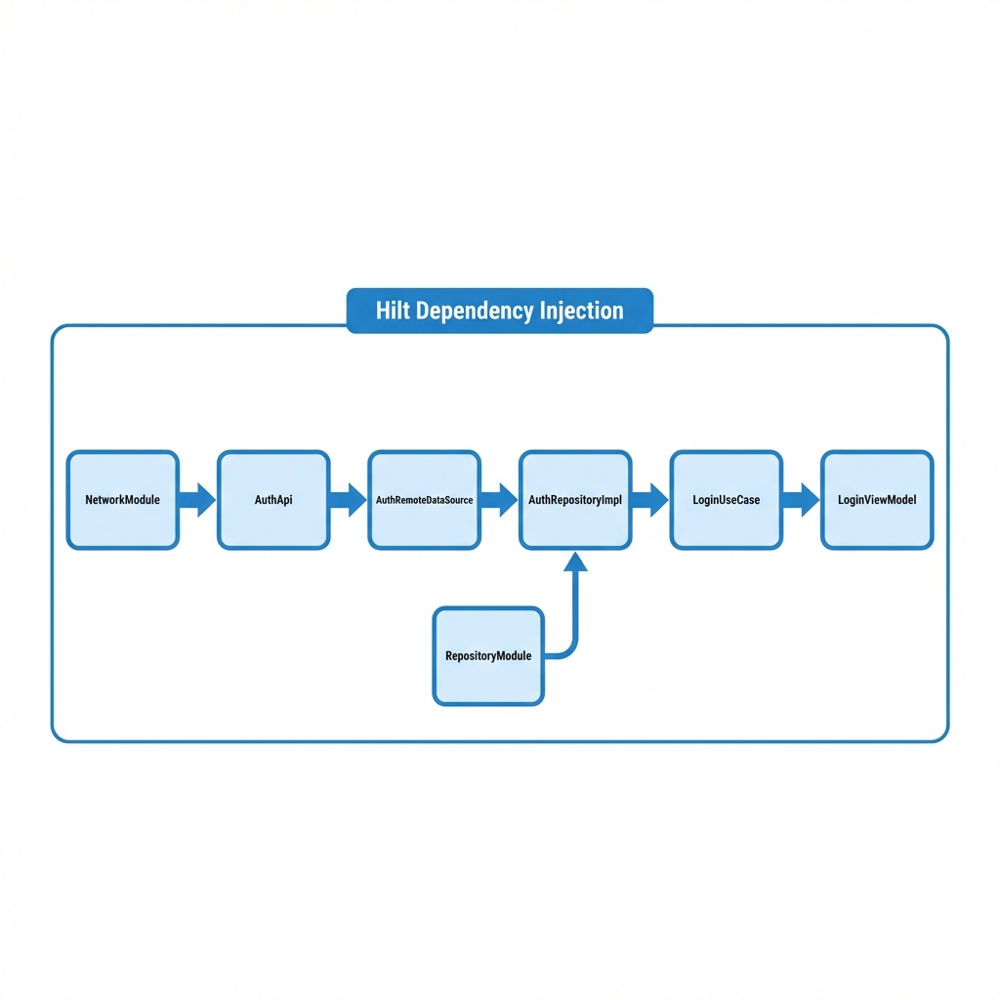

# Login Flow - Loanova Android

Dokumentasi alur login dalam aplikasi Loanova Android menggunakan Clean Architecture dan MVVM Pattern.

---

## Arsitektur Overview



**Layer-layer dalam aplikasi:**

| Layer | Komponen |
|-------|----------|
| **UI Layer** | LoginScreen.kt, LoginViewModel.kt, LoginUiState.kt |
| **Domain Layer** | LoginUseCase.kt, IAuthRepository.kt, User.kt |
| **Data Layer** | AuthRepositoryImpl.kt, AuthRemoteDataSource.kt, AuthApi.kt |
| **External** | Backend API |

---

## Alur Login Step-by-Step



**Langkah-langkah:**

1. **User** input username & password di LoginScreen
2. **User** klik tombol "MASUK"
3. **LoginScreen** memanggil `viewModel.login(username, password)`
4. **LoginViewModel** validasi input (cek kosong)
5. **LoginViewModel** set loading state = true
6. **LoginViewModel** panggil `loginUseCase.execute()`
7. **LoginUseCase** panggil `repository.login()`
8. **AuthRepositoryImpl** panggil `remoteDataSource.login()`
9. **AuthRemoteDataSource** panggil `authApi.login()` (POST ke backend)
10. **Backend API** return response (success/error)
11. **Response** di-propagate balik ke ViewModel
12. **LoginViewModel** update state (success atau error)
13. **LoginScreen** react ke state, navigate ke Dashboard jika sukses

---

## Detail per Layer

### 1. UI Layer

| File | Responsibility |
|------|----------------|
| `LoginScreen.kt` | Smart Composable, inject ViewModel, handle navigation |
| `LoginViewModel.kt` | State management dengan StateFlow, call UseCase |
| `LoginUiState.kt` | Immutable UI state (isLoading, success, error) |

### 2. Domain Layer

| File | Responsibility |
|------|----------------|
| `LoginUseCase.kt` | Enkapsulasi business logic login |
| `IAuthRepository.kt` | Interface (contract) untuk repository |
| `User.kt` | Domain model untuk user |

### 3. Data Layer

| File | Responsibility |
|------|----------------|
| `AuthRepositoryImpl.kt` | Implementasi repository, mapping DTO → Domain |
| `AuthRemoteDataSource.kt` | Abstraksi network call |
| `AuthApi.kt` | Retrofit interface, define endpoint |

---

## Dependency Flow (Hilt DI)



**Alur injeksi:**
```
NetworkModule → AuthApi → AuthRemoteDataSource → AuthRepositoryImpl → LoginUseCase → LoginViewModel
```

---

## SOLID Principles Applied

| Principle | Implementation |
|-----------|---------------|
| **S**ingle Responsibility | Setiap class punya 1 tugas |
| **O**pen/Closed | Interface memungkinkan extension |
| **L**iskov Substitution | Repository bisa di-mock untuk testing |
| **I**nterface Segregation | Interface kecil dan fokus |
| **D**ependency Inversion | Domain define interface, Data implement |
